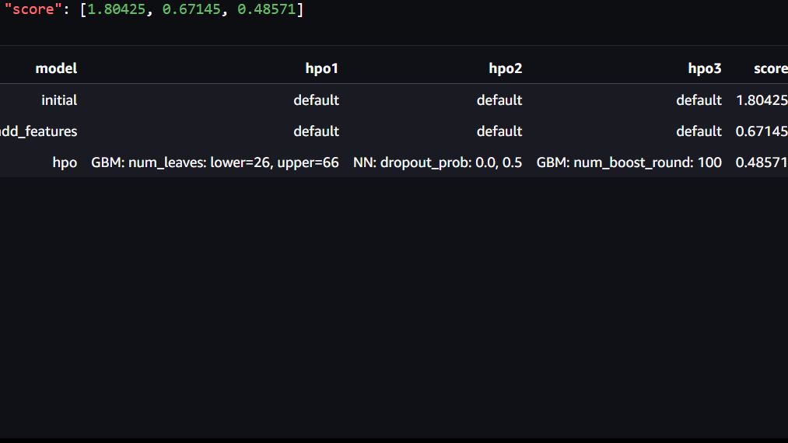

# Report: Predict Bike Sharing Demand with AutoGluon Solution
#### Kolawole-Jacobs Demilade

## Initial Training
### What did you realize when you tried to submit your predictions? What changes were needed to the output of the predictor to submit your results?
I tried doing the project on my local environment, so I decided to use sagemaker because it would be more convenient.
I had no negative prediction values, if there were, they would have been set to zero.
As expected, the first model did not perform well beacause no feature engineering was carried out on it.

### What was the top ranked model that performed?
The WeightedEnsemble_L3 model

## Exploratory data analysis and feature creation
### What did the exploratory analysis find and how did you add additional features?
The datetime was split into year, month, day and hour and the seasin and weather features were converted to categorical. This creation of new features proved to be beneficial in subsequent processes later on

### How much better did your model preform after adding additional features and why do you think that is?
After the addition of the new features the model had a score of 0.67145 from 1.80425 without the additional features and this was a resultant of the feature engineering processes carried out in the previous step

## Hyper parameter tuning
### How much better did your model preform after trying different hyper parameters?
The model performed better than the initial model and the additional features model. It had an improved score of 0.4857 compared to the previous score of the additional features model which was 0.67145. Further experimentation with the hyperparameters can improve the model further.

### If you were given more time with this dataset, where do you think you would spend more time?
Perform extensive data analysis and feature engineering as improved features will lead to score improvement.

### Create a table with the models you ran, the hyperparameters modified, and the kaggle score.

### Create a line plot showing the top model score for the three (or more) training runs during the project.

### Create a line plot showing the top kaggle score for the three (or more) prediction submissions during the project.

## Summary
The features play a very crucial role to the score and great insights can be gained with exploratory data analysis. I was able to use AutoGluon to develop a machine learning regression model. On the long run, my goal will be to improve the model through feature and engineering and more hyperparameter tuning.
